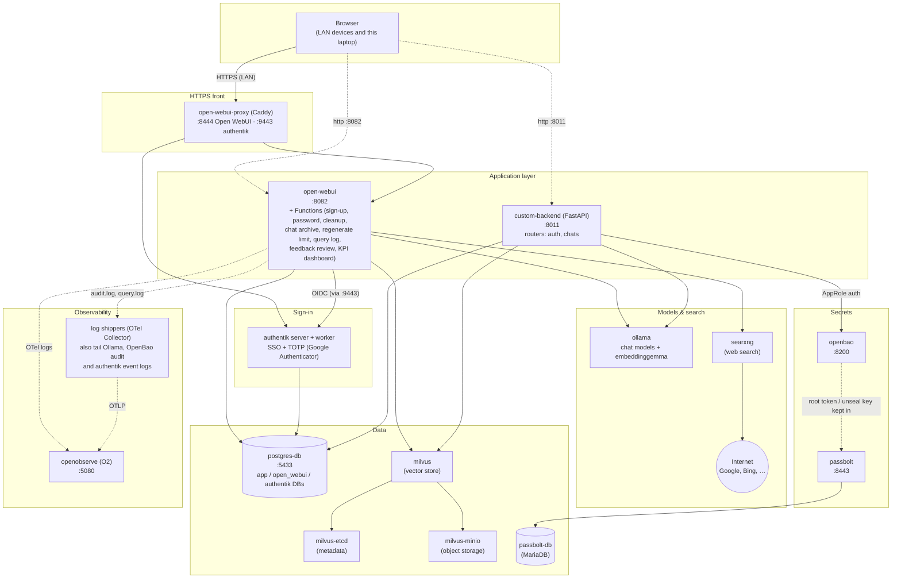

# Laptop AI Backend

A local AI stack on a personal laptop: Open WebUI as the chat frontend on local Ollama models, with web search through SearXNG and RAG on Milvus; sign-in through authentik with Google Authenticator; a custom FastAPI backend on PostgreSQL; OpenBao and Passbolt for secrets; and OpenObserve for logs and audit trails.

## Architecture



All services share the `ai-network` Docker bridge network, orchestrated via [devops/docker-compose.yml](devops/docker-compose.yml). Not drawn: the optional `lgtm` service and the one-shot setup jobs (see the table below).

## Stack

| Service | Purpose | Port |
|---|---|---|
| `postgres-db` | PostgreSQL 16 (custom-backend's database plus the `open_webui` and `authentik` databases) | 5433 → 5432 |
| `ollama` | Local LLM inference engine (chat models and the `embeddinggemma` embedding model) | (internal) |
| `open-webui` | Chat UI: Ollama models, web search, RAG on Milvus, sign-in through authentik, extended by the Functions in [devops/open-webui/functions/](devops/open-webui/functions/) | 8082 → 8080 |
| `open-webui-proxy` | Caddy HTTPS front for devices on the LAN (cert from Caddy's local CA): Open WebUI on 8444, authentik on 9443 | 8444 → 443, 9443 |
| `authentik-server` + `authentik-worker` | SSO with TOTP (Google Authenticator) for Open WebUI and OpenBao; sign-up, invitations, password reset (see [Open WebUI SSO + MFA](#open-webui-sso--mfa-authentik)) | (through `open-webui-proxy`, 9443) |
| `searxng` | Self-hosted metasearch engine for Open WebUI's web search | (internal, 8080) |
| `milvus` + `milvus-etcd` + `milvus-minio` | Vector store for RAG document embeddings | (internal, 19530) |
| `openbao` | Secrets storage (Postgres creds, AppRole broker) | 8200 |
| `passbolt-db` | MariaDB for Passbolt (dedicated, separate from postgres-db) | (internal) |
| `passbolt` | Password manager (stores OpenBao/AppRole tokens) | 8443 → 443 |
| `custom-backend` | FastAPI app: auth, chats, RAG document ingestion | 8011 → 8000 |
| `openobserve` | O2 observability platform: logs and audit trails (see [Logs in OpenObserve](#logs-in-openobserve)) | 5080 |
| `openwebui-audit-shipper` | OpenTelemetry Collector shipping Open WebUI's audit log (who did what) and query log to O2 | (internal) |
| `ollama-log-shipper` | OpenTelemetry Collector shipping Ollama's request log (read from its Docker log file) to O2 | (internal) |
| `openbao-audit-shipper` | OpenTelemetry Collector shipping OpenBao's audit log to O2 | (internal) |
| `authentik-events-shipper` | OpenTelemetry Collector shipping authentik's audit events to O2 | 127.0.0.1:24224 (fluentd, from Docker) |
| `lgtm` | Grafana + Loki + Tempo + Mimir. **Optional**: compose profile `lgtm`, not started by default (saves ~0.8 GB RAM); start it with `docker compose -f devops/docker-compose.yml --profile lgtm up -d lgtm` | 3001 (UI), 4317/4318 (OTLP) |
| `milvus-init-auth` | One-shot job that rotates Milvus's default root password | (runs on `up`, then exits) |
| `authentik-db-init` | One-shot job that creates the `authentik` database | (runs on `up`, then exits) |
| `open-webui-fn-migrate` | One-shot job that creates the Functions' `fn_*` tables (see [Function tables](#function-tables)) | (runs on `up`, then exits) |
| `caddy-ca-export` | One-shot job that copies Caddy's public root cert for Open WebUI to trust | (runs on `up`, then exits) |

## Prerequisites

- Docker and Docker Compose
- Ollama models already pulled somewhere on the host; point `OLLAMA_MODELS_PATH` in `.env` at that directory (mounted into the `ollama` container)

## Configuration

All credentials and secrets are read from environment variables — none are hardcoded. Copy the example file and fill in real values before running anything:

```bash
cp .env.example .env
```

`.env` is gitignored and is picked up automatically by `docker compose`. Variables:

| Variable | Used by | Purpose |
|---|---|---|
| `OLLAMA_MODELS_PATH` | `ollama` | Host path to your pulled Ollama models, mounted into the container |
| `POSTGRES_USER` | `postgres-db`, `custom-backend` | Postgres role |
| `POSTGRES_PASSWORD` | `postgres-db`, `custom-backend` | Postgres password |
| `POSTGRES_DB` | `postgres-db`, `custom-backend` | Database name |
| `WEBUI_SECRET_KEY` | `open-webui` | Session signing secret |
| `INIT_DB_DATABASE_URL` | `database/alembic/` | Full async connection string for running Alembic migrations from the host (mapped port `5433`) |
| `OPENBAO_ROLE_ID` / `OPENBAO_SECRET_ID` | `custom-backend` | AppRole credentials used to authenticate to OpenBao and fetch Postgres credentials at startup — generated by `openbao/bootstrap.sh`, see [openbao/README.md](openbao/README.md) |
| `PASSBOLT_SMTP_USER` / `PASSBOLT_SMTP_PASSWORD` / `PASSBOLT_SMTP_FROM` | `passbolt`, `open-webui` | Gmail SMTP relay Passbolt uses to send registration/recovery emails — see [PASSBOLT.md](PASSBOLT.md). The user/password are also passed to `open-webui` as `SMTP_USER`/`SMTP_PASSWORD` for signup verification emails |
| `PASSBOLT_DB_PASSWORD` | `passbolt-db`, `passbolt` | Password for the dedicated MariaDB instance Passbolt uses (its officially supported database) |
| `MILVUS_ROOT_PASSWORD` | `milvus-init-auth`, `open-webui` | Milvus root password — rotated in from the `root`/`Milvus` default on first boot, then used by Open WebUI to authenticate |
| `OPENOBSERVE_ROOT_USER_EMAIL` / `OPENOBSERVE_ROOT_USER_PASSWORD` | `openobserve`, `open-webui` | Root login for the OpenObserve UI/API, created on O2's first start (password needs lower, upper, digit and special characters) |
| `OPENOBSERVE_BASIC_AUTH` | `open-webui`, `openwebui-audit-shipper` | base64 of `email:password` above, used to send Open WebUI's logs to O2's `openwebui_backend` stream and its audit log to `openwebui_audit`. Regenerate when either changes: `printf '%s:%s' "$OPENOBSERVE_ROOT_USER_EMAIL" "$OPENOBSERVE_ROOT_USER_PASSWORD" \| base64 -w0` |
| `OPEN_WEBUI_HOST` | `open-webui-proxy` | LAN IP or hostname other devices use to reach Open WebUI over HTTPS on port 8444 |
| `OLLAMA_BASE_URL` / `DEFAULT_CHAT_MODEL` | `custom-backend` | Optional — Ollama endpoint (default `http://ollama:11434`) and chat model (default `llama3.2`, must already be pulled) for the RAG chat endpoints |
| `OLLAMA_CONTAINER_ID` | `ollama-log-shipper` | Full ID of the running `ollama` container, whose Docker log file the shipper reads (`docker inspect -f '{{.Id}}' laptop-ollama`); update it after recreating `ollama` |
| `AUTHENTIK_SECRET_KEY` / `AUTHENTIK_BOOTSTRAP_EMAIL` / `AUTHENTIK_BOOTSTRAP_PASSWORD` | `authentik-server`, `authentik-worker` | authentik's signing key and its first admin (`akadmin`, applied on first start only) — see [First-time setup](#first-time-setup) |
| `AUTHENTIK_MFA_REQUIRED` | authentik | `true` (default) asks everyone for a TOTP code, `false` only authentik admins — see [Open WebUI SSO + MFA](#open-webui-sso--mfa-authentik) |
| `OPEN_WEBUI_OIDC_CLIENT_ID` / `OPEN_WEBUI_OIDC_CLIENT_SECRET` | authentik, `open-webui` | Open WebUI's OIDC client, written into authentik by its blueprint |
| `OPEN_WEBUI_AUTHENTIK_API_TOKEN` | authentik, `open-webui` | Token of the service account that deletes a user's authentik account when they're deleted in Open WebUI — see [Deleting users](#deleting-users) |
| `OPENBAO_ADMIN_PASSWORD` / `OPENBAO_READONLY_PASSWORD` | `openbao/setup-users.sh` | Passwords for the human OpenBao logins `bao-admin` and `bao-readonly` (the root token is for emergencies only) |
| `OPENBAO_OIDC_CLIENT_ID` / `OPENBAO_OIDC_CLIENT_SECRET` | authentik, `openbao/setup-users.sh` | Optional — lets people sign in to OpenBao through authentik; see [openbao/README.md](openbao/README.md) |
| `SEARXNG_SECRET` | `searxng` | Signs SearXNG's cookies (`openssl rand -hex 32`) |
| `RAG_RERANKING_MODEL` | `open-webui` | Reranker for web and document search (default `cross-encoder/ms-marco-MiniLM-L6-v2`); a saved setting in Open WebUI overrides it |

`custom-backend` does not read `POSTGRES_PASSWORD` or a `DATABASE_URL` directly — it fetches its Postgres credentials from OpenBao (see below) at startup.

## Running

```bash
docker compose -f devops/docker-compose.yml up -d postgres-db openbao   # bring up the secrets dependency first
cd openbao && ./bootstrap.sh               # one-time: unseal, write secrets, create AppRole (see openbao/README.md)
# copy the OPENBAO_ROLE_ID / OPENBAO_SECRET_ID it prints into .env
docker compose -f devops/docker-compose.yml up -d   # start everything else
```

- Open WebUI: https://`OPEN_WEBUI_HOST`:8444 from any device on the LAN, this one included; sign-in goes through authentik. Trust Caddy's root CA once per device to get rid of the certificate warning: `docker cp laptop-open-webui-proxy:/data/caddy/pki/authorities/local/root.crt caddy-root.crt`, then import it into the OS/browser trust store. http://localhost:8082 and `http://<LAN-IP>:8082` reach Open WebUI directly too, but without HTTPS, so on the LAN everything (including the sign-in token) crosses the network unencrypted; point people at 8444.
- authentik: https://`OPEN_WEBUI_HOST`:9443/if/admin/ (admin UI), `/if/user/` (a user's own password and authenticators)
- OpenObserve: http://localhost:5080 (root login from `.env`)
- Custom backend API: http://localhost:8011
- OpenBao UI: http://localhost:8200/ui (sign in as `bao-admin`/`bao-readonly`, or through authentik with method OIDC; the root token in `openbao/keys.json` is for emergencies)
- Passbolt: https://localhost:8443 (self-signed cert; see [PASSBOLT.md](PASSBOLT.md) for one-time admin registration)
- Postgres: `localhost:5433` (credentials from `.env`)
- Grafana: http://localhost:3001, only while the optional `lgtm` service is running

Note: OpenBao starts **sealed** after every container restart or host reboot — run `cd openbao && ./auto-unseal.sh` before `custom-backend` will be able to start.

## Open WebUI SSO + MFA (authentik)

Open WebUI sign-in goes through [authentik](https://goauthentik.io) (`authentik-server` + `authentik-worker`, using a separate `authentik` database in `postgres-db`), which asks for a TOTP code from Google Authenticator or any other TOTP app on every login (`AUTHENTIK_MFA_REQUIRED=false` turns that off for everyone except authentik admins, see below). Open WebUI's own email/password sign-in is turned off.

- authentik is served by `open-webui-proxy` at `https://<OPEN_WEBUI_HOST>:9443` (same Caddy CA as Open WebUI on 8444). The login page's password field has an eye icon to show/hide the password (`allow_show_password` in [open-webui-sso.yaml](authentik/blueprints/open-webui-sso.yaml); authentik has no such option for the password boxes on the sign-up, invitation and reset forms). Opening Open WebUI goes straight to authentik's login page (`OAUTH_AUTO_REDIRECT`, done early by [devops/open-webui/static/loader.js](devops/open-webui/static/loader.js) so Open WebUI's own sign-in page doesn't flash first), so there's one sign-in, not two. Flows that finish without a destination (password reset, signing in at `:9443` directly, logout) would end on authentik's app dashboard at `/`; Caddy redirects that bare `/` to Open WebUI, which signs the user straight in. Use `https://<OPEN_WEBUI_HOST>:9443/if/admin/` for authentik's admin UI and `/if/user/` for a user's own authentik settings (password, authenticators). Open WebUI's own page, with **Continue with authentik** and **Sign up**, only shows after logging out or after a sign-in error.
- **Signed out after 3 hours without activity** (everyone except Open WebUI admins): no mouse, keyboard, scroll or touch in any Open WebUI tab for 3 hours signs the person out of Open WebUI and of authentik, so the next visit asks for the password and authenticator code again. Done in the browser by [devops/open-webui/static/loader.js](devops/open-webui/static/loader.js) (`IDLE_LIMIT_MS`); Open WebUI itself has no idle timeout, so a copied sign-in token would stay valid for its normal 4 weeks.
- Its configuration is the blueprint [authentik/blueprints/open-webui-sso.yaml](authentik/blueprints/open-webui-sso.yaml), applied by the worker on start and whenever the file changes. It makes MFA mandatory in authentik's default login flow (users without a TOTP device get a QR code to set one up before their first login completes; TOTP and static recovery codes only; after a code is entered, that browser isn't asked again for 3 hours — the password still is, and other browsers/devices still need a code) and registers the Open WebUI OIDC client.
- **Switching MFA off or on:** set `AUTHENTIK_MFA_REQUIRED` in `.env`: `true`/`1` (default) means everyone, `false`/`0` means authentik admins (akadmin) only. Everyone else then signs in with just the password, even if they have an authenticator; it stays registered for when MFA is switched back on. authentik picks up the value only when the blueprints are applied, so after changing it run:

  ```bash
  docker compose -f devops/docker-compose.yml up -d --no-deps authentik-server authentik-worker
  docker exec laptop-authentik-worker ak apply_blueprint /blueprints/custom/open-webui-sso.yaml
  docker exec laptop-authentik-worker ak apply_blueprint /blueprints/custom/password-recovery.yaml
  ```

  With `false`, **Forgot password** still asks for a code from people who have an authenticator, and lets those without one reset with the emailed code alone.
- Open WebUI calls authentik server-side at the same `https://<OPEN_WEBUI_HOST>:9443` URL browsers use, so issuer and endpoint URLs match. It trusts Caddy's CA through `caddy-ca-export`, a one-shot service that copies only Caddy's public root cert (never the CA key) into the `caddy-ca-public` volume.
- Anyone can sign up: Open WebUI's sign-in page has a **Sign up** button under **Continue with authentik** (added by [devops/open-webui/static/loader.js](devops/open-webui/static/loader.js); recreate `open-webui` after editing it), and authentik's own login page has a **Sign up** link. Both go to the `self-enrollment` flow ([authentik/blueprints/self-enrollment.yaml](authentik/blueprints/self-enrollment.yaml)); afterwards authentik sends the user on to Open WebUI. It asks for name, email and password only (the email doubles as the authentik username), refuses an email that's already registered, and creates the account **inactive** until the emailed confirmation link (valid 30 minutes) is opened. Only then does it continue to TOTP setup and login. Confirming the email matters because of the account linking below. Admins can also invite people (see [Inviting users](#inviting-users)). The first SSO login links an existing Open WebUI account with the same email (`OAUTH_MERGE_ACCOUNTS_BY_EMAIL`). A new email gets a new Open WebUI account that's active (`user`) straight away: authentik has already confirmed the address, so the signup verification Function skips its own email for SSO accounts (Valve `activate_sso_users`).

### First-time setup

1. Add the authentik variables to `.env` (see `.env.example`), e.g.
   ```bash
   echo "AUTHENTIK_SECRET_KEY=$(openssl rand -base64 60 | tr -d '\n')" >> .env
   echo "OPEN_WEBUI_OIDC_CLIENT_ID=$(openssl rand -hex 20)" >> .env
   echo "OPEN_WEBUI_OIDC_CLIENT_SECRET=$(openssl rand -base64 60 | tr -d '\n')" >> .env
   ```
   plus `AUTHENTIK_BOOTSTRAP_EMAIL` / `AUTHENTIK_BOOTSTRAP_PASSWORD`. Use your Open WebUI admin email as `AUTHENTIK_BOOTSTRAP_EMAIL`: then `akadmin` signs in to Open WebUI as the existing admin.
2. Let containers reach the host's published port 9443. A host firewall (ufw by default denies incoming) blocks container → host traffic, and Open WebUI's server-side OIDC calls go that way:
   ```bash
   sudo ufw allow from 172.16.0.0/12 to any port 9443 proto tcp comment 'open-webui -> authentik'
   ```
3. `docker compose -f devops/docker-compose.yml up -d`. From here, Open WebUI password sign-in is rejected (`ENABLE_PASSWORD_AUTH=false`).
4. Open `https://<OPEN_WEBUI_HOST>:9443/if/admin/`, sign in as `akadmin`, and scan the QR code with Google Authenticator when asked.
5. Invite each existing Open WebUI user (see [Inviting users](#inviting-users)) with their **same email**, so their accounts get linked. They choose their own password and set up TOTP while signing up.
6. Turn off Open WebUI's login form. `ENABLE_LOGIN_FORM=false` in compose is ignored because Open WebUI has already saved `ui.enable_login_form` in its database, and while that form is on, `/api/v1/auths/signup` still accepts password signups. Delete the saved value so the compose setting applies, then restart:
   ```bash
   docker exec laptop-postgres psql -U "$POSTGRES_USER" -d open_webui -c "DELETE FROM config WHERE key = 'ui.enable_login_form'"
   docker compose -f devops/docker-compose.yml restart open-webui
   ```

**Rollback:** set `ENABLE_PASSWORD_AUTH=true` and `ENABLE_LOGIN_FORM=true` on `open-webui` and run `up -d` again. If authentik is down, nobody can sign in to Open WebUI, and the rollback is how you get back in.

**Forgot password:** on authentik's login page, click **Forgot username or password?** (also offered on the password step), or an admin sends a recovery link from **Directory → Users**. Flow `password-recovery` ([authentik/blueprints/password-recovery.yaml](authentik/blueprints/password-recovery.yaml)): enter email or username → type the **6-digit code** emailed to the account's address (valid 15 minutes, wrong guesses slow down further attempts; same tab, no link). The email ([authentik/email-templates/password_reset_code.html](authentik/email-templates/password_reset_code.html), mounted at `/templates` in authentik) puts the code in the preview line, so Gmail and iOS Mail offer **Copy code**, and one tap or double-click selects the whole code; a real copy button isn't possible because email clients strip scripts → enter a TOTP or static recovery code → set a new password (same rules as sign-up) → signed in. Unknown emails/usernames are refused straight away (the sign-up form already reveals which emails are registered). The TOTP step means a stolen mailbox alone can't reset an account; someone who lost both password and authenticator needs an admin (below, then an admin recovery link).

**Lost authenticator:** in authentik, open the user under **Directory → Users → MFA Authenticators** and delete the TOTP device. The user enrolls a new one on their next login.

### Inviting users

Besides self sign-up, you can send new users a one-time invite link ([authentik/blueprints/invitations.yaml](authentik/blueprints/invitations.yaml)):

1. In authentik's admin UI (`https://<OPEN_WEBUI_HOST>:9443/if/admin/`), go to **Directory → Invitations → Create**.
2. Fill in:
   - **Name**: e.g. `invite-jatin`
   - **Flow**: `invitation-enrollment`
   - **Expires**: a date a few days out
   - **Single use**: on
   - **Custom attributes**: `{"email": "their@email.com"}`. Use the email of their existing Open WebUI account, if they have one, so the accounts get linked.
3. Open the new invitation's row, copy the **link**, and send it to them.
4. They open the link, choose a username, name and password (the [password rules](#password-rules) apply), confirm their email from the link authentik sends (valid 24 hours; the account stays inactive until then, since the pre-filled email can be changed — if the link expires, delete the inactive user under **Directory → Users** and send a new invite, because the single-use invite is already spent), and scan a QR code with Google Authenticator. That creates and signs in their authentik account.
5. They click **Continue with authentik** on Open WebUI. People with an existing Open WebUI account (same email) go straight in. New people get an active account straight away.

Links without a valid invitation are refused ("Invalid invite/invite not found"). Delete an unused invitation to revoke it. Don't open a link yourself to check it: opening it uses up a single-use invitation.

To see how far each person has got, run `devops/open-webui/sync-user-status.sh`. It records each person's stage (not invited → invited → authentik account → MFA set up → linked to Open WebUI) and when they reached it in the `fn_user_sso_status` table (see [Function tables](#function-tables)), prints that table, and shows the stage as each Open WebUI user's profile status (e.g. "📨 SSO: invited"). It only replaces a profile status that's empty or one it wrote itself. Profile statuses are visible to other users and editable by their owner; the table is admin-only. It's a snapshot, so re-run it after inviting or onboarding someone.

### Password rules

New passwords must be **at least 8 characters, with an uppercase letter, a lowercase letter, a number and a symbol**.

- **authentik** ([authentik/blueprints/password-policy.yaml](authentik/blueprints/password-policy.yaml)) also rejects passwords found in known data breaches (Have I Been Pwned; only the first 5 characters of the password's SHA-1 hash leave the server). Its zxcvbn strength check is off, since it rejected random 8-character passwords that meet the rules. The rules apply when users sign up through an invite and when they change their own password. Passwords an admin sets under **Directory → Users → Set password** are not checked, so follow the rules there by hand.
- **Open WebUI** checks the same length and character rules (`ENABLE_PASSWORD_VALIDATION` / `PASSWORD_VALIDATION_REGEX_PATTERN` in compose) on signup, password change, admin create/edit and the Password Reset Function. With SSO on, these only matter if password sign-in is re-enabled.
- Existing passwords aren't affected until they're next changed.
- **After upgrading authentik**, re-apply the blueprint: authentik re-applies its own default password-change blueprint when it changes, which resets the policy to its default (8 characters, no character rules). Use **Customization → Blueprints → laptop-ai-backend - Password creation rules → Apply**, or:
  ```bash
  docker exec laptop-authentik-worker ak apply_blueprint /blueprints/custom/password-policy.yaml
  ```
- To change the rules, edit both places and keep them in sync. authentik picks up blueprint edits by itself; Open WebUI needs `docker compose -f devops/docker-compose.yml up -d open-webui`.

## Open WebUI signup verification

New Open WebUI password signups start as `pending` (`DEFAULT_USER_ROLE=pending`) and are emailed a verification link; confirming it promotes them to `user`. Accounts created by SSO sign-in are promoted to `user` immediately without the email (Valve `activate_sso_users`, on by default), because authentik's sign-up and invitation flows already confirm the address. This is an Open WebUI event Function, [devops/open-webui/functions/signup_email_verification.py](devops/open-webui/functions/signup_email_verification.py) (Open WebUI declined adding it to core — [discussion #31626](https://github.com/open-webui/open-webui/discussions/31626)).

One-time setup, after the stack is up:

1. In Open WebUI, go to **Admin → Functions → Import**, choose that file, save, and switch it on.
2. Open the Function's settings (Valves) and set `base_url` to the address users open Open WebUI at — `https://<OPEN_WEBUI_HOST>:8444` for LAN users (default `http://localhost:8082`). Leave the SMTP fields empty to use `SMTP_USER`/`SMTP_PASSWORD` from compose.
3. Restart once so it registers its routes: `docker restart laptop-open-webui`, then check `docker logs laptop-open-webui 2>&1 | grep "verification routes"`.
4. Check **Admin → Settings → General → Default User Role** is `pending` — a value saved there overrides the env var.

How it behaves:

- Links expire after 2 hours (`token_max_age_seconds` Valve). The token sits in the link's `#` fragment and the page asks the user to click **Verify email**, so tokens don't reach server logs and mail scanners that open links don't verify accounts.
- Pending users see a "Check your email" screen (`PENDING_USER_OVERLAY_TITLE`/`PENDING_USER_OVERLAY_CONTENT` in compose) linking to `/api/v1/auths/verify-email/resend`, a page where they can request a new link (rate-limited, same response whether or not the account exists). If **Admin → Settings → Authentication** already has saved overlay text, that wins over the compose values — clear it or paste the same text there.
- Each account is verified at most once (recorded in the `fn_email_verified` table — see [Function tables](#function-tables)), so an admin can suspend a user by setting them back to `pending` without an old link or a resend re-activating them.
- The Function is stored in Open WebUI's database, not read from the repo — re-import it after editing the file.
- The `open-webui` image is pinned by digest because the Function uses Open WebUI internals. When bumping it, re-test a signup end to end.

### Password reset

Open WebUI has no "forgot password" of its own. A second, independent event Function, [devops/open-webui/functions/password_reset.py](devops/open-webui/functions/password_reset.py), adds it — import and enable it the same way, set its `base_url` Valve, and restart once.

- Users go to `/api/v1/auths/forgot-password` (Open WebUI's login page can't be customised to link it, so share or bookmark the URL), enter their email, and get a reset link that expires in 30 minutes and works once — any password change invalidates older links. Pending and deactivated accounts can't reset.
- Whenever a password changes (by the user, an admin, or a reset), the user gets a notice email with the forgot-password link, so an unexpected change doesn't go unnoticed. Turn off with the `notify_on_password_change` Valve.
- A reset only logs out the user's other sessions if Open WebUI has Redis configured; this stack doesn't, so existing sessions stay valid until they expire (`JWT_EXPIRES_IN`, default 4 weeks).

### Password expiry

A third event Function, [devops/open-webui/functions/password_expiry.py](devops/open-webui/functions/password_expiry.py), makes passwords expire after 180 days (`max_age_days` Valve). It needs the Password Reset Function, since expired users recover through the forgot-password page (or an admin sets a new password). NIST SP 800-63B advises against forced periodic changes; enable this only if a policy requires it.

- Open WebUI doesn't record password age, so the Function keeps its own record in the `fn_password_age` table (see [Function tables](#function-tables)), reset on signup and on every password change. Existing users (no record yet) are counted from their account creation date — Open WebUI's `user.created_at`, since it doesn't record password changes — but always get at least 14 days, with reminders, from when the Function first sees them (`grace_days_for_existing`), so enabling it doesn't lock out old accounts. Turn off `start_from_account_creation` to count from that first sighting instead.
- An expired user who enters the correct password gets an error on the login page saying the password has expired, and is **emailed a one-time link to set a new one** (the Password Reset Function's page; valid 30 minutes, at most one email per 10 minutes). Open WebUI's login page can't be redirected, so the email is the way forward. If the Password Reset Function isn't enabled, the message tells them to ask an admin instead. A wrong password gets Open WebUI's normal error, so nothing leaks about whether an account exists.
- Users signing in within 14 days of expiry (`warn_days`) get a reminder email, at most once a day.
- Admin passwords never expire (`exempt_admins`, on by default).
- **Overview:** while signed in to Open WebUI as an admin, open `/api/v1/auths/password-expiry` (e.g. http://localhost:8082/api/v1/auths/password-expiry) for every user's password date, expiry date, days left and status, soonest first; add `?format=json` for JSON. Dates marked * are estimated for users the Function hasn't recorded yet, and viewing the page doesn't start anyone's clock.
- The 180 days and other settings are the Function's Valves (**Admin → Functions → Password Expiry → ⚙**), stored in Open WebUI's database — not environment variables.
- Only the email/password sign-in is checked (not LDAP, OAuth or API keys), and already-signed-in sessions last until they expire.

### Deleting users

Another event Function, [devops/open-webui/functions/authentik_user_cleanup.py](devops/open-webui/functions/authentik_user_cleanup.py), makes **Admin → Users → Delete** in Open WebUI also delete the person's authentik (SSO) account, so they can't sign in again or come back as a new pending user. Import and enable it the same way, then restart `open-webui` once (it hooks Open WebUI's delete endpoint at startup).

- It finds the authentik account by the SSO link Open WebUI stored at the user's first login. For users who never signed in with SSO, it uses the single authentik account with the same email (Valve `match_by_email`) and does nothing if several share it.
- authentik superusers (such as `akadmin`) and service accounts are never deleted.
- It calls authentik's API as the `open-webui-user-sync` service account ([authentik/blueprints/open-webui-user-sync.yaml](authentik/blueprints/open-webui-user-sync.yaml)), which may only view and delete users. Its token is `OPEN_WEBUI_AUTHENTIK_API_TOKEN` in `.env` (generate with `openssl rand -hex 32`), passed to authentik and to `open-webui` as `AUTHENTIK_API_TOKEN`.
- If authentik can't be reached, the Open WebUI user is still deleted and the failure is logged. Delete the authentik user by hand under **Directory → Users**.
- **Their chats are kept.** Open WebUI deletes a user's chats with the account, so the Function first copies them into an admin-only archive (`fn_archived_chats`). If that copy fails, the user isn't deleted. Browse it at **`/api/v1/archived-chats`** on Open WebUI while signed in as an admin (e.g. `https://<OPEN_WEBUI_HOST>:8444/api/v1/archived-chats`): each chat opens as a readable transcript, can be downloaded as JSON, or deleted. Attachments aren't kept. Archived chats stay until you delete them.
- **Deleting someone who asked to be erased completely:** switch off the Function's `archive_chats` Valve (**Admin → Functions → authentik User Cleanup → ⚙**) before deleting them, then switch it back on.
- It also removes what Open WebUI leaves behind after a delete: the user's memories, notes, tags and uploaded files, including their embeddings in Milvus (Open WebUI's own file delete leaves the Milvus collection), and their rows in `fn_email_verified` / `fn_password_age`. `fn_user_sso_status` keeps them, marked `removed` by its sync script.

### Deleted chats

Open WebUI deletes chats for good: there's no trash. The Chat Soft Delete Function, [devops/open-webui/functions/chat_soft_delete.py](devops/open-webui/functions/chat_soft_delete.py), copies a chat into the same admin-only archive just before Open WebUI deletes it, so it can be brought back. Import and enable it like the others, then restart `open-webui` once.

- Covers deleting one chat, **Delete all chats** in Settings, and deleting a folder with its chats. Deleting a single message inside a chat isn't covered.
- Archived chats show up at **`/api/v1/archived-chats`** next to deleted users' chats, marked by reason. A deleted chat has a **Restore** button that gives it back to its owner (out of any folder, unpinned and unshared) and removes it from the archive.
- If the copy fails, the chat is still deleted and the error is logged.
- A whole user's chats are left to the User Cleanup Function's `archive_chats` Valve (above), so switching that off still erases someone completely.

### Function tables

The Functions (and the SSO status script) keep their state in Postgres, in Open WebUI's `open_webui` database, so it's backed up with the rest of Open WebUI's data:

| Table | Used by | Holds |
|---|---|---|
| `fn_email_verified` | Signup Email Verification | Users verified once (`user_id`, `verified_at`) |
| `fn_password_age` | Password Expiry | When each password was last set, and the last reminder (`user_id`, `changed_at`, `last_warned_at`) |
| `fn_archived_chats` | authentik User Cleanup, Chat Soft Delete | Chats of deleted users and deleted chats, copied just before deletion (full chat JSON and messages, the user's email/name, when, by whom and why) — see [Deleting users](#deleting-users) and [Deleted chats](#deleted-chats) |
| `fn_user_sso_status` | `devops/open-webui/sync-user-status.sh` (not a Function) | Each person's SSO onboarding stage and when they reached each step, keyed by lowercased email (see [Inviting users](#inviting-users)) |

They're created by a separate Alembic setup, [devops/open-webui/migrations/](devops/open-webui/migrations/), which tracks its history in `fn_alembic_version` so it never touches Open WebUI's own migrations in the same database. The one-shot `open-webui-fn-migrate` service applies it on every `docker compose up` (a no-op once current), and `open-webui` waits for it. Its first revision also imports rows from the Functions' earlier SQLite files (`email_verification.db` / `password_expiry.db` on the `open-webui-data` volume), if present. Once that's done, those files are unused and can be deleted.

To add a table or column, add a new revision under `devops/open-webui/migrations/versions/` (the Functions don't create tables themselves).

## Custom Backend

Located in [custom-backend/](custom-backend/). A FastAPI app using SQLAlchemy async ORM with `asyncpg`.

Layout: `main.py` (app setup), `db.py` (OpenBao-backed engine), `models.py`, `schemas.py`, `chat_service.py` (LangChain + Milvus), and `routers/auth.py` / `routers/chats.py`.

Endpoints:
- `GET /health` — health check
- `/ui` — minimal static chat page for exercising the chat/RAG endpoints by hand
- Users & auth (`routers/auth.py`): `POST /users` (register), `GET /users`, `POST /users/verify`, `POST /users/deactivate`, `POST /users/reactivate`, `POST /login`, `POST /mfa/enable`, `POST /mfa/disable`, `POST /mfa/verify-otp`, `POST /password/change`, `POST /password/forgot`, `POST /password/reset`
- Chats & RAG (`routers/chats.py`): `POST /chats`, `GET /chats/{chat_id}/messages`, `POST /chats/{chat_id}/messages`, `POST /chats/{chat_id}/documents` (ingest up to 5 documents per request into Milvus)

Run locally without Docker (skips migrations; needs `OPENBAO_ADDR`, `OPENBAO_ROLE_ID` and `OPENBAO_SECRET_ID` exported):

```bash
cd custom-backend
pip install -r requirements.txt
uvicorn main:app --reload --port 8001
```

### Database schema / migrations

[database/init_db.py](database/init_db.py) defines the schema (`users`, `user_chats`, `messages`) that [database/alembic/](database/alembic/) migrations track. `custom-backend`'s container entrypoint runs `alembic upgrade head` on every start, so no manual step is needed under Docker. To apply migrations from the host instead (uses `INIT_DB_DATABASE_URL` against the mapped port `5433`):

```bash
export $(grep -v '^#' .env | xargs)
cd database && alembic upgrade head
```

## RAG embeddings

Documents are embedded with Ollama's **`embeddinggemma`** (Google, 768-dim, 2048-token context) in both Open WebUI and `custom-backend`. It replaced `nomic-embed-text` for better retrieval: in a quick test it separated the right chunk from the runner-up about 3× more clearly. Both apps send embeddinggemma's task prefixes (`task: search result | query: ` on questions, `title: none | text: ` on documents), which the model is trained with.

- Pull the model before first use: `docker exec laptop-ollama ollama pull embeddinggemma`.
- **Open WebUI** saves the embedding engine/model in its database the first time they're set, and the saved values override the compose file. Change them under **Admin → Settings → Documents**. After changing the model, click **Reindex Knowledge Base Vectors** there, since old vectors don't match the new model.
- **custom-backend** keeps one Milvus collection per model (`custom_backend_docs_<model>`), so switching `EMBEDDING_MODEL` starts an empty collection. Re-upload documents to chats after a switch.
- To change the model, update `RAG_EMBEDDING_MODEL` (open-webui) and `EMBEDDING_MODEL` (custom-backend) in compose together, plus the prefixes: the query/document prefixes in compose and `_PREFIXES` in [custom-backend/chat_service.py](custom-backend/chat_service.py). Other models need different prefixes, or none.

## Web search

Open WebUI can search the web through **SearXNG** (`searxng` service, [devops/searxng/settings.yml](devops/searxng/settings.yml)), a self-hosted metasearch engine that queries Google, Bing, Brave, DuckDuckGo and others without API keys or accounts. It's only reachable inside the Docker network.

- Regular users don't see the chat **Controls** panel (system prompt, temperature and other model settings); admins do. Set by `USER_PERMISSIONS_CHAT_CONTROLS`/`_VALVES`/`_SYSTEM_PROMPT`/`_PARAMS=false` in compose, but `user.permissions` is a saved setting that overrides compose once it exists — change it under **Admin → Users → Groups → Default permissions**. It's hidden in the UI only: Open WebUI doesn't reject those settings if someone sends them through the API directly.
- Under answers, regular users also don't get **Edit**, **Read aloud**, **Fork** or **Info**; admins do. The first three are the same saved permissions (`USER_PERMISSIONS_CHAT_EDIT`/`_TTS`/`_IMPORT=false` in compose). Fork has no switch of its own and comes with chat import, which goes too. Info has no permission, so [devops/open-webui/static/loader.js](devops/open-webui/static/loader.js) hides it. Users can still edit their own questions.
- Everyone sees a **welcome banner** at the top of the chat window with tips for good answers (from the family guide) until they close it with ×. Edit it under **Admin → Settings → Interface → Banners**; give it a new ID if people who already closed it should see the new text.
- Regular users get at most 3 answers per question (the first plus 2 regenerations): at 3/3 the **Regenerate** button is greyed out ([devops/open-webui/static/loader.js](devops/open-webui/static/loader.js)), and the Regenerate Limit Function ([devops/open-webui/functions/regenerate_limit.py](devops/open-webui/functions/regenerate_limit.py)) refuses a 4th answer if one is asked for anyway. Import and enable the Function like the others and switch on **Global**. The number is its `max_answers` Valve, and `MAX_ANSWERS` in `loader.js` must match it.
- Web search is **on by default in every chat for all users** (`DEFAULT_INTERFACE_SETTINGS={"webSearch": "always"}` in compose, the same as each user choosing **Settings → Interface → Web Search: Always**). A user can switch it off for themselves there. The default is a saved setting (`ui.default_interface_settings`); once saved it overrides compose, so change it under **Admin → Settings → General** (default interface settings) or delete that row so compose applies again.
- For each message, Open WebUI writes one or two search queries, fetches the top 8 result pages, picks the relevant parts with the embedding model and a local reranker (`RAG_RERANKING_MODEL`), and answers from them with sources. It works with any model. The 8 is a saved setting (`web.search.result_count`, **Admin → Settings → Web Search**); compose's `WEB_SEARCH_RESULT_COUNT=3` only applies to a fresh install. Sites that never give the page loader readable text (e.g. investing.com, youtube.com) are blocked in the same place (domain filter), and other results take their place.
- With `fast-ai`, the model writing the answer sees only the latest question and its search results (Chat History Trim Function, [devops/open-webui/functions/chat_history_trim.py](devops/open-webui/functions/chat_history_trim.py), attached to that model only): the small model kept answering an earlier question in multi-topic chats. Writing the search queries still sees the recent chat, so follow-ups like "where is he from?" work, but "summarize your last answer" has nothing to work from with this model.
- Answer quality is measured with [evals/](evals/README.md): a fixed set of questions run through the real chat pipeline and scored, so a settings change can be compared before and after.
- Searches leave your machine through SearXNG, so each engine sees your IP but not who asked.
- Enable/engine/URL are saved Open WebUI settings (`web.search.*`), which override the compose values once saved. Change them under **Admin → Settings → Web Search**.
- `SEARXNG_SECRET` in `.env` signs SearXNG's cookies. Generate it with `openssl rand -hex 32`.
- SearXNG uses its default engines plus Google and Bing, so search keeps working when some engines block requests (too many requests or a CAPTCHA, which happens after bursts of searches). If every engine is blocked, answers come without web sources until the blocks expire; people then see a red line above the answer, *"No web results found. This answer is from the model's own knowledge and may be outdated or wrong."* (Web Search Notice Function, [devops/open-webui/functions/web_search_notice.py](devops/open-webui/functions/web_search_notice.py): import, enable and switch on **Global**; the text is its `message` Valve). It shows whenever search was on but no web sources reached the model, also when results came back and every page was filtered out or empty, which Open WebUI's own "No search results found" doesn't cover. After editing [devops/searxng/settings.yml](devops/searxng/settings.yml), run `docker compose -f devops/docker-compose.yml up -d --no-deps --force-recreate searxng`.
- **Settings as code:** the tuned Open WebUI settings (answer and search prompts, retrieval and web search settings, model parameters, Function switches, banners, permissions) are saved in [devops/open-webui/settings.yaml](devops/open-webui/settings.yaml). After changing settings in the Admin UI, run `python3 devops/open-webui/settings.py export` and commit the file. To change them from the file instead, edit it and run `python3 devops/open-webui/settings.py apply`, which shows the changes, asks, and keeps a backup of the previous values. `settings.py diff` shows whether Open WebUI still matches the file. Each version that goes live is recorded for the [KPI dashboard](#kpi-dashboard)'s per-revision view.
- Harmless startup errors: SearXNG logs `ahmia`/`torch` "can't register engine" (Tor-only engines) and a missing `limiter.toml` (the limiter is off, since the service is internal).

## Answer feedback (👍/👎)

Users can rate any answer with 👍 or 👎, optionally with a reason or a comment. Open WebUI saves each rating in its `feedback` table together with a copy of the chat at that moment, which stays after the chat is edited or deleted. Admins can read those copies, so rating an answer shares that chat with them.

**Ratings don't improve answers on their own.** The models don't learn from them, and nothing in answering a question reads them. Open WebUI uses them only for statistics: ratings per model under **Admin → Analytics**, and the model leaderboard under **Admin → Evaluations**, which only changes when the rated answer had answers from other models next to it (multi-model or arena chats), so ordinary ratings leave it unchanged. Improving answers from ratings is a manual loop:

1. Import and enable the Feedback Review Function, [devops/open-webui/functions/feedback_review.py](devops/open-webui/functions/feedback_review.py), like the other Functions, then restart `open-webui` once so its page is registered.
2. While signed in as an admin, open **`/api/v1/feedback-review`** (e.g. `https://<OPEN_WEBUI_HOST>:8444/api/v1/feedback-review`). It lists the 👎 answers of the last 90 days, newest first, each with the question, what was searched for, the sources, the answer, and the user's reason or comment. Add `?rating=up` for 👍, `?rating=all` for both, `?days=30` for a shorter period, or `?format=json` for JSON. The page changes nothing.
3. Look for patterns and change the matching setting:
   - **Searched for** misses the question or mixes in an earlier topic → the query generation prompt (**Admin → Settings → Interface → Query Generation Prompt**).
   - **(no web search)** → web search was off in that chat, or the model answered without searching.
   - Searched well, but the sources don't contain the answer → more results per search (**Admin → Settings → Web Search → Search Result Count**).
   - The sources contain the answer, but the answer gets it wrong → a limit of the model; a larger model does better.

Not built yet: putting admin-approved 👍 answers into a "Verified answers" knowledge collection that the model searches. That would be the first way ratings feed back into answers directly.

## KPI dashboard

To see whether a settings change made answers faster or better, the KPI Dashboard Function, [devops/open-webui/functions/kpi_dashboard.py](devops/open-webui/functions/kpi_dashboard.py), shows the main numbers per day. Import and enable it like the other Functions, then restart `open-webui` once so its page is registered.

While signed in as an admin, or as a member of the Open WebUI group **kpi-viewers**, open **`/api/v1/kpi`** (e.g. `https://<OPEN_WEBUI_HOST>:8444/api/v1/kpi`). It counts from `COUNT_FROM` in the Function (2026-10-04, UTC; move it forward to start from zero again), with totals at the top and target levels (Benchmarks) at the bottom. On a phone each row shows as a card:

- **Answers / Failed:** answers written, and how many ended in an error.
- **Answer p75 / p90:** how long Ollama took per answer (reading the prompt + writing). p75: 3 in 4 answers were at least this fast. p90: 1 in 10 answers took at least this long. Hover a column header for the same explanation. Web search and reading the pages come on top; Open WebUI doesn't record when an answer finished, so the full wait can't be shown.
- **Prompt tokens:** median prompt size, mostly the search results. Bigger prompts mean slower answers on this laptop's CPU.
- **Tokens/s:** how fast the model writes.
- **Regenerated / At limit:** share of questions that got more than one answer, and how many reached the 3-answer limit. A rising share usually means worse answers.
- **👍 / 👎:** ratings given that day; the details are on the Feedback Review page above.

Pick this month, or the last 7, 14, 30 or 90 days, and a model at the top of the page, or add `?days=30`, `?model=fast-ai:latest` or `?format=json` to the address.

**By settings revision** (link at the top, or `?view=revisions`): one row per version of [devops/open-webui/settings.yaml](devops/open-webui/settings.yaml) with the dates it was live and the same numbers, the live one highlighted, each with its change from the version before (green = better, red = worse). That's how to tell whether a settings change helped. `settings.py apply` and `export` record a new version whenever the file's content changed; `python3 devops/open-webui/settings.py record --label "what changed"` does it by hand, and `record --from-git` adds the past commits of the file. Settings changed in the Admin UI count only once exported, Function code and model changes aren't versions, and a version with only a few answers says little. Answers from before the first recorded version show as "before tracking". The page changes nothing. Only chats that still exist are counted, and temporary chats never are.

To let someone else see it, create a group named `kpi-viewers` (**Admin → Users → Groups**), add them, and send them the link; there's no sidebar link. The group name is the Function's `viewer_group` Valve (empty = admins only). Everyone else gets a 403. The page has only totals and medians, no questions, answers or names, but on a quiet day small counts can hint at who asked or rated. Feedback Review stays admin-only.

## Logs in OpenObserve

OpenObserve (http://localhost:5080, **Logs**) collects these streams:

| Stream | Sent by | What's in it |
|---|---|---|
| `openwebui_backend` | `open-webui` (OTel logs) | Open WebUI's warnings and errors (`GLOBAL_LOG_LEVEL=WARNING`) |
| `openwebui_audit` | `openwebui-audit-shipper` | Who did what in Open WebUI (below) |
| `openwebui_queries` | `openwebui-audit-shipper` | One line per chat request from the Query Log Function ([devops/open-webui/functions/query_log.py](devops/open-webui/functions/query_log.py), enabled and **Global**): user, model, the generated search queries, source sites and chunk count. The question and the answer themselves aren't logged |
| `ollama` | `ollama-log-shipper` | Ollama's API requests (status, duration, path) and server events. A 500 often only means the caller hung up (Stop, Regenerate, an `open-webui` restart); check Open WebUI's log before blaming Ollama |
| `openbao_audit` | `openbao-audit-shipper` | Who read or changed which OpenBao secret path, from where, and errors such as `permission denied`. Secret values and tokens are HMAC-hashed by OpenBao |
| `authentik_events` | `authentik-events-shipper` | Logins, failed logins, logouts, password and MFA changes (below) |

## Open WebUI audit log in OpenObserve

Open WebUI's regular logs (stream `openwebui_backend`) are mostly web-server request lines with the client IP but **no user**. To see who did what, Open WebUI's audit log is on (`AUDIT_LOG_LEVEL=METADATA` in compose) and shipped to O2 stream **`openwebui_audit`** by `openwebui-audit-shipper`, an OpenTelemetry Collector ([devops/otel-collector/openwebui-audit.yaml](devops/otel-collector/openwebui-audit.yaml)). Open WebUI only writes audit entries to `data/audit.log`, never over OTel, so the collector tails that file from the `open-webui-data` volume (read-only).

- Each entry's message reads `<email> <METHOD> <URL> <status>`, e.g. `alice@example.com POST http://localhost:8082/api/v1/users/update 200`, and has searchable fields `user_email`, `user_name`, `user_role`, `user_id`, `verb`, `request_uri`, `response_status_code`, `source_ip` and `user_agent`. Example O2 query: `SELECT * FROM "openwebui_audit" WHERE user_email = 'alice@example.com'`.
- `METADATA` records no request or response bodies. Don't raise it to `REQUEST`: that would log sign-in passwords and chat content.
- Only POST/PUT/PATCH/DELETE requests are audited, and `/chats`, `/chat` and `/folders` are skipped (`AUDIT_EXCLUDED_PATHS`), so chatting itself isn't logged. Set `ENABLE_AUDIT_GET_REQUESTS=true` to include reads, at the cost of much more volume.
- Requests without a signed-in user, such as a password sign-in attempt, show `-` in place of the email.
- The collector keeps its read position in the `otelcol-audit-storage` volume, so restarts don't re-send entries. On its first start it ships whatever `audit.log` already holds. Open WebUI rotates the file at 10 MB (zipped copies stay in `data/`).

## authentik events in OpenObserve

authentik's audit events go to O2 stream **`authentik_events`**, next to Open WebUI's `openwebui_audit`. Covered: logins, failed logins, logouts, password changes, MFA setup, Open WebUI authorizations and admin changes.

- How: `authentik-server`/`authentik-worker` use Docker's `fluentd` logging driver to send their output to `authentik-events-shipper`, an OpenTelemetry Collector ([devops/otel-collector/authentik-events.yaml](devops/otel-collector/authentik-events.yaml)). It keeps only the event lines (authentik logs each event as JSON with `"event": "Created Event"`) and drops the per-request access logs.
- Each entry's message reads `<username> <action> <IP>`, e.g. `akadmin login_failed 192.168.29.119`. Fields: `action`, `user_username`, `user_email`, `client_ip`, and `context` (a JSON string with the stage, request details, etc.). Example: `SELECT * FROM "authentik_events" WHERE action = 'login_failed'`.
- The driver is async, so authentik starts even when the shipper is down (events from that time are lost), and `docker logs` still works through Docker's local cache. The shipper's port 24224 is published on 127.0.0.1 only, because the Docker daemon on the host is what connects to it.
- authentik also keeps its own event log (**Events → Logs** in the admin UI, 1 year by default).

## Known gaps / TODO

- `custom-backend/models.py` and `database/init_db.py` declare the same models independently — keep them in sync by hand when changing either.
- Logs are sent to OpenObserve with the O2 root credentials — a dedicated ingestion-only user would be safer.
- Open WebUI's traces and metrics are off while `lgtm` isn't running (`ENABLE_OTEL_TRACES`/`ENABLE_OTEL_METRICS=false`); turn them back on after starting it.
- Next steps are in [ROADMAP.md](ROADMAP.md).

## More documentation

- [openbao/README.md](openbao/README.md) — OpenBao setup, unsealing, logins and backups
- [PASSBOLT.md](PASSBOLT.md) — Passbolt admin registration and use
- [evals/README.md](evals/README.md) — answer-quality evals
- [ROADMAP.md](ROADMAP.md) — what this stack still lacks as an LLM engineering setup, step by step
- [DELETED_BRANCHES.md](DELETED_BRANCHES.md) — branches deleted on GitHub and how to restore one
