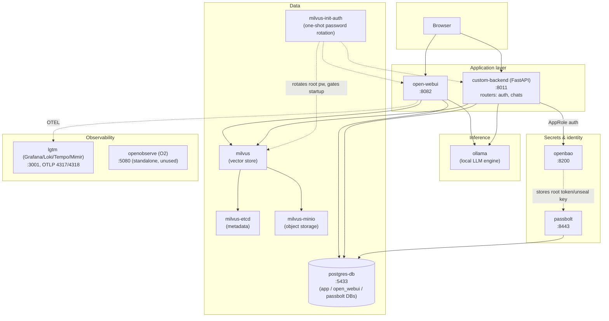

# Laptop AI Backend

A local, hybrid AI development stack for a personal laptop: a custom FastAPI backend backed by PostgreSQL, alongside Ollama for local model inference, Open WebUI as a chat frontend, Milvus for RAG vector storage, and Grafana LGTM / OpenObserve for observability.

## Architecture



All services share the `ai-network` Docker bridge network, orchestrated via [devops/docker-compose.yml](devops/docker-compose.yml).

## Stack

| Service | Purpose | Port |
|---|---|---|
| `postgres-db` | PostgreSQL 16 database (hosts app, `open_webui`, and `passbolt` DBs) | 5433 → 5432 |
| `ollama` | Local LLM inference engine | (internal) |
| `open-webui` | Chat UI, talks to Ollama + Milvus for RAG | 8082 → 8080 |
| `milvus` + `milvus-etcd` + `milvus-minio` | Vector store for RAG document embeddings | (internal, 19530) |
| `milvus-init-auth` | One-shot job that rotates Milvus's default root password | (n/a, runs once) |
| `lgtm` | Grafana + Loki + Tempo + Mimir (metrics/traces/logs) | 3001 (UI), 4317/4318 (OTLP) |
| `openobserve` | Standalone O2 observability platform (not yet wired to any service) | 5080 |
| `openbao` | Secrets storage (Postgres creds, AppRole broker) | 8200 |
| `passbolt` | Password manager (stores OpenBao/AppRole tokens) | 8443 → 443 |
| `custom-backend` | FastAPI app: auth, chats, RAG document ingestion | 8011 → 8000 |

All services share the `ai-network` Docker bridge network.

## Prerequisites

- Docker and Docker Compose
- Ollama models already pulled somewhere on the host; point `OLLAMA_MODELS_PATH` in `.env` at that directory (mounted into the `ollama` container)

## Configuration

All credentials and secrets are read from environment variables — none are hardcoded. Copy the example file and fill in real values before running anything:

```bash
cp .env.example .env
```

`.env` is gitignored and is picked up automatically by `docker compose`. Variables:

| Variable | Used by | Purpose |
|---|---|---|
| `OLLAMA_MODELS_PATH` | `ollama` | Host path to your pulled Ollama models, mounted into the container |
| `POSTGRES_USER` | `postgres-db`, `custom-backend` | Postgres role |
| `POSTGRES_PASSWORD` | `postgres-db`, `custom-backend` | Postgres password |
| `POSTGRES_DB` | `postgres-db`, `custom-backend` | Database name |
| `WEBUI_SECRET_KEY` | `open-webui` | Session signing secret |
| `INIT_DB_DATABASE_URL` | `database/alembic/` | Full async connection string for running Alembic migrations from the host (mapped port `5433`) |
| `OPENBAO_ROLE_ID` / `OPENBAO_SECRET_ID` | `custom-backend` | AppRole credentials used to authenticate to OpenBao and fetch Postgres credentials at startup — generated by `openbao/bootstrap.sh`, see [openbao/README.md](openbao/README.md) |
| `PASSBOLT_SMTP_USER` / `PASSBOLT_SMTP_PASSWORD` / `PASSBOLT_SMTP_FROM` | `passbolt` | Gmail SMTP relay Passbolt uses to send registration/recovery emails — see [PASSBOLT.md](PASSBOLT.md) |
| `MILVUS_ROOT_PASSWORD` | `milvus-init-auth`, `open-webui` | Milvus root password — rotated in from the `root`/`Milvus` default on first boot, then used by Open WebUI to authenticate |
| `OPENOBSERVE_ROOT_USER_EMAIL` / `OPENOBSERVE_ROOT_USER_PASSWORD` | `openobserve` | Root login for the OpenObserve UI/API |
| `OLLAMA_BASE_URL` / `DEFAULT_CHAT_MODEL` | `custom-backend` | Optional — Ollama endpoint (default `http://ollama:11434`) and chat model (default `llama3.2`, must already be pulled) for the RAG chat endpoints |

`custom-backend` does not read `POSTGRES_PASSWORD` or a `DATABASE_URL` directly — it fetches its Postgres credentials from OpenBao (see below) at startup.

## Running

```bash
docker compose -f devops/docker-compose.yml --project-directory . up -d postgres-db openbao   # bring up the secrets dependency first
cd openbao && ./bootstrap.sh               # one-time: unseal, write secrets, create AppRole (see openbao/README.md)
# copy the OPENBAO_ROLE_ID / OPENBAO_SECRET_ID it prints into .env
docker compose -f devops/docker-compose.yml --project-directory . up -d   # start everything else
```

- Open WebUI: http://localhost:8082
- Grafana: http://localhost:3001
- Custom backend API: http://localhost:8011
- OpenBao UI: http://localhost:8200/ui (log in with the root token from `openbao/keys.json`)
- Passbolt: https://localhost:8443 (self-signed cert; see [PASSBOLT.md](PASSBOLT.md) for one-time admin registration)
- Postgres: `localhost:5433` (credentials from `.env`)

Note: OpenBao starts **sealed** after every container restart or host reboot — run `cd openbao && ./auto-unseal.sh` before `custom-backend` will be able to start.

## Custom Backend

Located in [custom-backend/](custom-backend/). A FastAPI app using SQLAlchemy async ORM with `asyncpg`.

Layout: `main.py` (app setup), `db.py` (OpenBao-backed engine), `models.py`, `schemas.py`, `chat_service.py` (LangChain + Milvus), and `routers/auth.py` / `routers/chats.py`.

Endpoints:
- `GET /health` — health check
- `/ui` — minimal static chat page for exercising the chat/RAG endpoints by hand
- Users & auth (`routers/auth.py`): `POST /users` (register), `GET /users`, `POST /users/verify`, `POST /users/deactivate`, `POST /users/reactivate`, `POST /login`, `POST /mfa/enable`, `POST /mfa/disable`, `POST /mfa/verify-otp`, `POST /password/change`, `POST /password/forgot`, `POST /password/reset`
- Chats & RAG (`routers/chats.py`): `POST /chats`, `GET /chats/{chat_id}/messages`, `POST /chats/{chat_id}/messages`, `POST /chats/{chat_id}/documents` (ingest up to 5 documents per request into Milvus)

Run locally without Docker (skips migrations; needs `OPENBAO_ADDR`, `OPENBAO_ROLE_ID` and `OPENBAO_SECRET_ID` exported):

```bash
cd custom-backend
pip install -r requirements.txt
uvicorn main:app --reload --port 8001
```

### Database schema / migrations

[database/init_db.py](database/init_db.py) defines the schema (`users`, `user_chats`, `messages`) that [database/alembic/](database/alembic/) migrations track. `custom-backend`'s container entrypoint runs `alembic upgrade head` on every start, so no manual step is needed under Docker. To apply migrations from the host instead (uses `INIT_DB_DATABASE_URL` against the mapped port `5433`):

```bash
export $(grep -v '^#' .env | xargs)
cd database && alembic upgrade head
```

## Known gaps / TODO

- `custom-backend/models.py` and `database/init_db.py` declare the same models independently — keep them in sync by hand when changing either.
- Nothing exports telemetry to OpenObserve yet; `open-webui` still sends OTEL data to `lgtm`.
